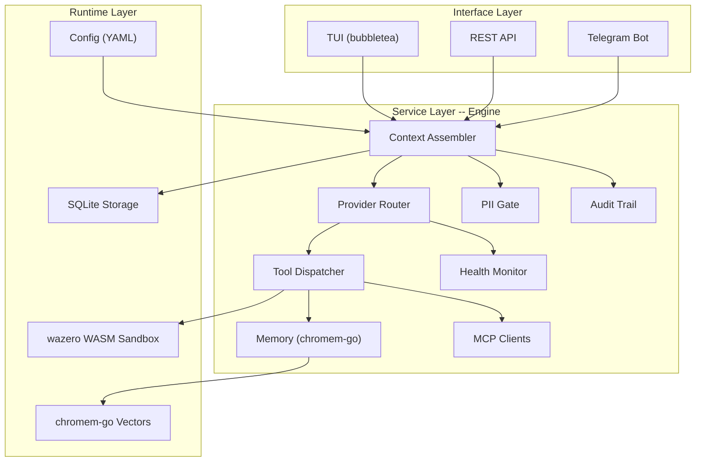

# GoGoClaw

**A security-first AI agent framework in Go.**

GoGoClaw is a self-contained AI agent framework that compiles to a single static binary with no CGo, no Docker, and no Node.js required. It is designed from the ground up to enforce security at every layer -- from WASM-sandboxed skill execution to network-level allowlists -- while remaining easy to deploy on any platform that Go supports.

Unlike frameworks that bolt security on as an afterthought, GoGoClaw treats every external interaction (LLM calls, tool execution, file access, network requests) as an untrusted boundary that must be explicitly permitted. The result is an agent you can run on production infrastructure without worrying about prompt-injection-driven lateral movement.

---

## Features

**Seven Security Layers**

- WASM sandboxing via wazero (skills never get raw filesystem or network access)
- Network allowlist (all outbound HTTP routed through NetworkGuard)
- PII gate (scans system, user, and tool messages before they reach the LLM)
- Secrets management (env-backed, never logged)
- Skill provenance (cryptographic signing and verification)
- Input sanitization (path traversal prevention, shell injection guards)
- Audit trail (structured logging of all tool invocations and decisions)

**Runtime Capabilities**

- WASM skill system powered by wazero -- extend the agent without recompiling
- Vector-backed memory with chromem-go for semantic recall
- Multi-provider support: OpenAI-compatible APIs and Ollama
- Multi-channel: interactive TUI (bubbletea), REST API, and Telegram bot
- MCP (Model Context Protocol) client support for connecting to external tool servers
- Live config reloading via fsnotify
- SQLite-backed conversation storage (WAL mode, pure Go via modernc.org/sqlite)
- Health monitoring with automatic provider failover

---

## Architecture



The framework enforces a strict three-layer separation:

1. **Interface** -- TUI, REST, and Telegram channels accept user input and render responses. They never touch LLM providers or tools directly.
2. **Service** -- The engine orchestrates context assembly, provider routing, tool dispatch, PII scanning, memory retrieval, and audit logging. All policy decisions happen here.
3. **Runtime** -- Skills execute inside wazero WASM sandboxes. Conversations persist in SQLite. Semantic memory lives in chromem-go vectors. Configuration is loaded from YAML files on disk.

---

## Quick Start

### Prerequisites

- Go 1.26 or later (install from https://go.dev/dl/)
- An API key for an OpenAI-compatible provider, or a running Ollama instance

### Install and Build

```bash
git clone https://github.com/DonScott603/gogoclaw.git
cd gogoclaw
make build
```

This produces `./bin/gogoclaw`.

### First Run

```bash
./bin/gogoclaw
```

On first launch, GoGoClaw runs an interactive bootstrap that:

1. Creates the `~/.gogoclaw/` directory structure (config, providers, agents, channels, skills, MCP).
2. Walks you through an interactive Q&A to configure your agent identity, LLM providers, and communication channels.
3. Collects sensitive values (API keys, bot tokens) with hidden input -- they are written to `~/.gogoclaw/env` and never logged.

After bootstrap completes, the TUI launches and you can start interacting with your agent immediately.

---

## Configuration

GoGoClaw stores all configuration under `~/.gogoclaw/`:

```
~/.gogoclaw/
  config.yaml            # Global settings (default provider, security flags, PII gate toggle)
  env                    # Secrets (API keys, tokens) -- loaded as environment variables
  providers/
    openai.yaml          # OpenAI-compatible provider config (model, endpoint, temperature)
    ollama.yaml          # Ollama provider config (model, endpoint)
  agents/
    default.yaml         # Agent identity, system prompt, tool permissions
  channels/
    tui.yaml             # TUI channel settings
    rest.yaml            # REST API bind address, CORS, auth
    telegram.yaml        # Telegram bot token env var, allowed users
  network.yaml           # Outbound HTTP allowlist (domains, ports, protocols)
  mcp/
    *.yaml               # MCP server definitions (one file per server)
  skills.d/
    *.wasm               # Installed WASM skills
  conversations.db       # SQLite conversation history
```

The bootstrap wizard auto-generates most of these files with sensible defaults. You can edit them directly -- changes to YAML files are picked up automatically via live reloading.

---

## Channel Usage

### TUI

The default interface. Keyboard shortcuts:

| Shortcut | Action |
|----------|--------|
| `Ctrl+L` | Open conversation list |
| `Ctrl+N` | Start a new conversation |
| `Ctrl+C` | Quit |

The TUI displays tool call invocations and results inline, and shows a status bar with current tool activity.

### REST API

Start the REST channel by enabling it in `~/.gogoclaw/channels/rest.yaml`. Example requests:

```bash
# Send a message
curl -X POST http://localhost:8080/api/message \
  -H "Content-Type: application/json" \
  -d '{"message": "Summarize this project"}'

# Check health
curl http://localhost:8080/api/health

# List conversations
curl http://localhost:8080/api/conversations

# Upload a file for context
curl -X POST http://localhost:8080/api/message \
  -F "message=Analyze this file" \
  -F "file=@report.pdf"
```

### Telegram

1. Create a bot via BotFather and note the token.
2. Set the token as an environment variable (e.g., add `TELEGRAM_BOT_TOKEN=...` to `~/.gogoclaw/env`).
3. Edit `~/.gogoclaw/channels/telegram.yaml` and add your Telegram username to `allowed_users`.

Telegram uses a fail-closed allowlist: only usernames listed in `allowed_users` can interact with the bot. Messages from unlisted users are silently dropped.

---

## Security Model

**WASM Sandboxing.**
Skills run inside wazero WebAssembly sandboxes. A skill has no access to the host filesystem, network, or environment variables. All capabilities (file read, HTTP fetch, memory store) are granted through the capability broker based on the skill's declared permissions in the agent config. A skill cannot escalate its own privileges.

**Network Allowlist.**
Every outbound HTTP request -- whether initiated by a tool, a skill, or an MCP client -- is routed through NetworkGuard, which checks the destination against `~/.gogoclaw/network.yaml`. Requests to domains not on the allowlist are rejected before a connection is opened. There is no implicit allow-all default.

**PII Gate.**
When enabled, the PII gate scans all messages sent to the LLM provider: system prompts, user messages, and tool results. Only assistant messages (which come from the LLM itself) are excluded. Detected PII patterns are redacted or cause the request to be blocked, depending on configuration.

**Secrets Management.**
API keys, tokens, and passwords are loaded from `~/.gogoclaw/env` at startup and injected as environment variables. They are never written to YAML config files, never included in log output, and never sent to the LLM as part of conversation context. On Linux and macOS the env file is restricted to owner-only permissions; on Windows it relies on the user home directory's inherited NTFS ACLs.

**Skill Provenance.**
WASM skill binaries can be cryptographically signed. The framework verifies signatures before loading a skill, preventing tampered or unauthorized code from executing inside the agent.

**Input Sanitization.**
All file paths pass through PathValidator, which rejects directory traversal attempts (e.g., `../../etc/passwd`) and enforces allowed root directories. Shell commands go through a confirmation gate that requires explicit user approval before execution.

**Audit Trail.**
Every tool invocation, skill execution, provider call, and security decision is logged to a structured audit trail. This provides a complete record of what the agent did and why, suitable for post-incident review.

**Note on at-rest encryption:** A config flag for at-rest encryption of conversation history and memory is reserved in the schema but not yet implemented. Conversation data in SQLite and vector memory are currently stored unencrypted on disk.

---

## MCP Server Configuration

GoGoClaw can connect to external MCP (Model Context Protocol) servers, making their tools available to the agent. Each server is defined in its own YAML file under `~/.gogoclaw/mcp/`.

### Stdio Transport

For MCP servers that communicate over stdin/stdout (e.g., local CLI tools):

```yaml
# ~/.gogoclaw/mcp/filesystem.yaml
name: filesystem
transport: stdio
command: npx
args:
  - "-y"
  - "@modelcontextprotocol/server-filesystem"
  - "/home/user/documents"
```

### SSE Transport

For MCP servers accessible over HTTP with Server-Sent Events:

```yaml
# ~/.gogoclaw/mcp/remote-tools.yaml
name: remote-tools
transport: sse
url: https://mcp.example.com/sse
```

When using SSE transport, you must add the server's domain to your network allowlist:

```yaml
# ~/.gogoclaw/network.yaml (add to allowed_hosts)
allowed_hosts:
  - "mcp.example.com"
```

MCP tools are discovered at startup and appear alongside built-in tools in the tool dispatcher. The agent can invoke them like any other tool, subject to the same security policies.

---

## Building and Testing

```bash
# Compile to ./bin/gogoclaw
make build

# Run all tests
make test

# Run golangci-lint
make lint

# Install to $GOPATH/bin
make install
```

All tests are table-driven. The test suite uses pure-Go SQLite (modernc.org/sqlite), so no C compiler or CGo is needed.

---

## License

Apache License 2.0. See [LICENSE](LICENSE) for the full text.
